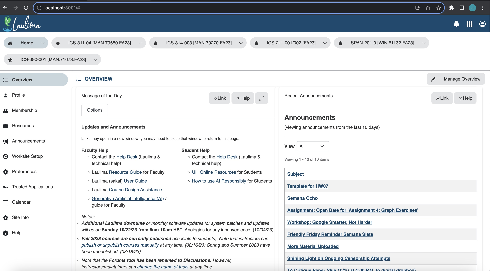
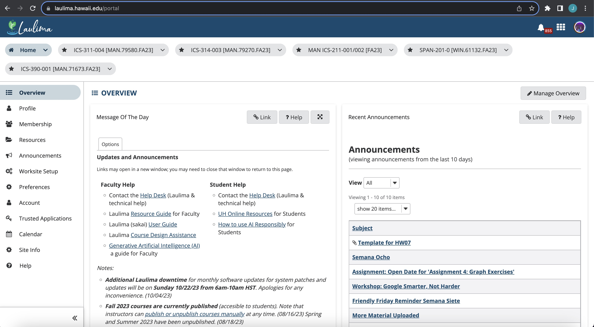

## Introduction:
In my limited experience learning and using the UI framework [Bootstrap](https://getbootstrap.com/), I have struggled more than when learning new actual programming languages. Something about Bootstrap just doesn't seem to want to click in my mind, and I often find myself scouring its documentation looking for solutions. Despite this, I am certain that Bootstrap is well worth the learning curve, as once I’ve got the hang of it, I will be able to rapidly create responsive web applications with ease. 

## Benefits of Giving CSS the Boot 
While I found satisfaction in employing basic CSS to style my HTML elements, I've come to appreciate the efficiency that Bootstrap brings to the table. It significantly reduces the volume of CSS coding required to achieve a desired visual aesthetic. The inclusion of Bootstrap's grid system has proven especially beneficial, streamlining the process of maintaining a consistent and uniform appearance across webpages. As a testament to Bootstrap's utility, I have recreated the University of Hawaii's learning environment homepage, with the actual site for reference below.

### My Creation:

 

### The Real Deal:

## Glass Slippers vs Boots

Bootstrap as well as all other UI frameworks are amazing tools for streamlining the design process. However, this comes at the cost of a lack of uniqueness across their webpages. It's not to say that these frameworks restrict creativity, rather they simply provide very simple and fast ways to make generic looking websites. 

## Conclusion
In summary, using Bootstrap can be advantageous for rapid development and responsiveness. However, it might lead to a less unique design and potentially slower performance. Not using Bootstrap allows for complete customization but requires more development effort and expertise. The choice between using Bootstrap or not depends on your specific project requirements and your design goals.

