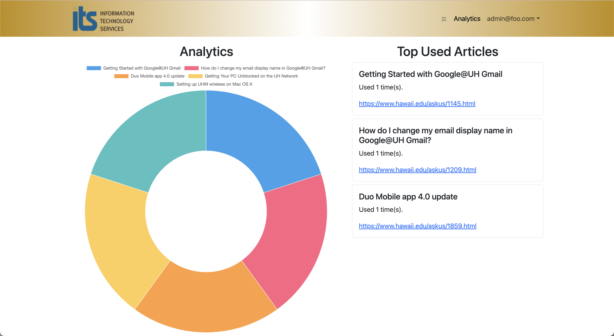

# Project Overview
The goal of this project is to improve the searching effectiveness of the University of Hawaii’s Ask Us search engine, which takes in user queries and attempts to return a list of IT-related articles that may help the users resolve their IT issues. Our group tryRebooting, implemented an AI search engine designed to alleviate the need to contact the IT help desk representative.

We wanted this AI search engine to be able to respond to queries as helpfully as possible for anyone with a specific question, or even a general topic to a question. This means being able to ask follow-up questions to unclear queries and being conversational.

All users have access to the interface at the landing page, but we also provided login capabilities in order for the AI to be able to store previous chat sessions(WIP). This includes “admin” accounts that have access to our “Analytics” page that helps to show the most popular articles used as references to form a response.

## Landing Page

In partnership with [James Ligeralde](https://jligeral.github.io/), our collaborative efforts focused on segmenting articles into distinct textual units. Employing OpenAI's sophisticated [text-embedding-ada-002](https://platform.openai.com/docs/guides/embeddings/what-are-embeddings) model, we skillfully embedded these text chunks. The resulting embeddings, along with the segmented text, found a home in the vector database [Pinecone](https://docs.pinecone.io/). Our responsibilities extended to embedding user queries using the same model and querying the vector database using cosine similarity. This facilitated the retrieval of pertinent articles, which, in turn, powered OpenAI's [text generation model](https://platform.openai.com/docs/guides/text-generation) to craft insightful and conversational responses.

## Analytics Page

Additionally, we developed an Analytics page featuring a visually engaging doughnut graph generated with [Chart.js](https://www.chartjs.org/), alongside links to the top 3 most used articles. This dynamic display highlighted the most frequently accessed articles, complemented by convenient links to the top three articles garnering the highest usage.

This project provided invaluable learning experiences, expanding my expertise in handling embedding models and vector databases. Collaborating within a team environment further honed my interpersonal skills. Moreover, delving into the intricacies of Meteor and React enhanced my proficiency in navigating their complexities to develop a fully functional website. A crucial lesson learned was the significance of maintaining the security of API keys and other sensitive information in the process of website creation.

To learn more about this project, please visit our team page [here](https://tryrebooting2023.github.io/)

