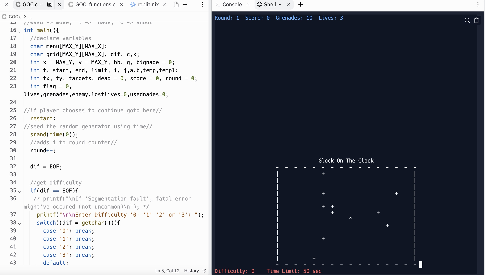
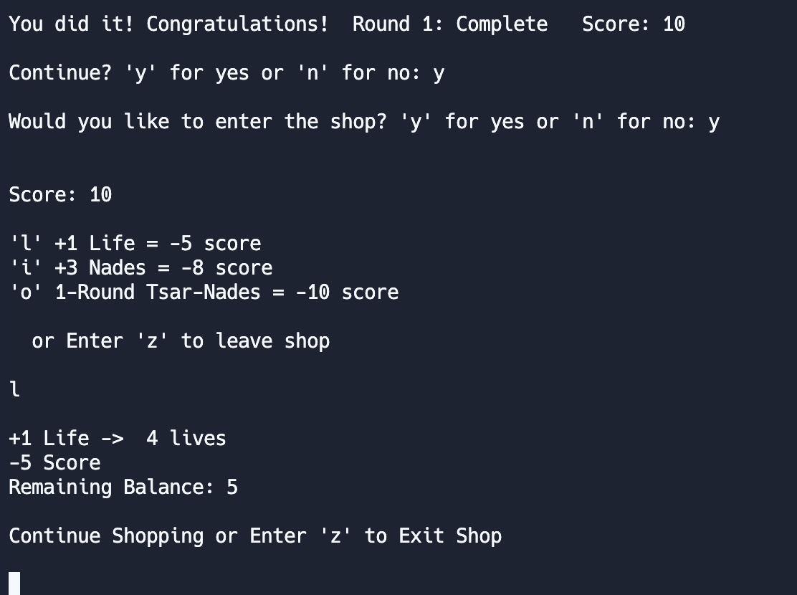

  
  

For the final project of EE 160, our team was tasked with creating an ASCII based game. After much deliberation my 2 group members and I, decided on creating a shooting game and aptly naming it Glock on the Clock. In the game the player controls a ship ">", and has to shoot all the randomly generated targets "+" on the stage before the times runs out. 

## My Responsibilities:

In this project, my responsibilities encompassed the implementation of user control over the ship, covering both movement and weapon usage. Additionally, I was charged with the dynamic placement of targets at random coordinates within the field, and overseeing interactions between the targets and the user-controlled ship. Furthermore, I took on the tasks of designing and implementing the point system, managing the timer, and incorporating a shop feature into the overall functionality of the project.

## What I Learned:

Through this project, I acquired a diverse skill set and valuable insights. Designing user controls for ship movement and weapon usage enhanced my programming skills, while implementing dynamic target spawning and interactions with the ship deepened my understanding of game mechanics. Taking charge of the point system, timer, and shop feature broadened my perspective on game development, emphasizing the importance of pacing and creating engaging user experiences. Overall, the project offered a comprehensive learning experience, touching on collision detection, system functionality, and the intricacies of in-game economies, collectively contributing to my growth as a developer.

## How the Game Works:

(Playing Field) Room to Roam
- border around the grid indicating position limits

(Player Avatar) Character and Movement 'wasd'
- ability to move in all directions considering objects and limits
- doesn't leave trail
- makes which way character is facing distinct

(Ability) Shooting 'o'
- pressing a button fires bullet from character traveling in same direction while considering objects and limits
  - bullet stops and disappears after hitting a wall or target
- can hit targets (the collision is recognized with score)

(Ability) Grenade 'i'
- button press to throw a grenade in front of character
- rids anything destroyable in square radius (player included)
  - player can die and lose lives
- considers limits, character orientation, and character position
  - 'nades bounce back to land in an open position if too many obstacles ahead or too close to the border
- shows an animation of explosion considering limits and player
- score increases the same amount as targets destroyed

(2nd Degree Ability) Nuke 'i button upgrade'
- grenade upgrade functioning the same
  - except only unlocks through the shop and with enough score
  - all nades become nukes for a round if the option is bought
- bigger blast radius, different display messages, different animations and visuals (distinguishable from regular grenades)
- destroying targets still recognized with incrementing score
- suicide still recognized especially with the larger radius
- still recognizes boundaries and the character position/orientation

(Danger) Yourself
- blast radius is a kill zone for the player
  - lose a life, respawn in starting position, and display warning messages
- no danger if character is beyond the blast

(Objective) Targets to Destroy
- randomly generated within room limits
  - always 10 total each round, no duplicate target positions
- only bullets, nades, and nukes interact with targets
  - character can't walk through them
- collisions are recognized with +1 score and target disappearing

(Round Progress & Shop Currency) Score
- keeps track of number of targets destroyed minus spent points
- 10 available score points per round
- accumulates through the rounds
- can be spent in the shop for perks

(Danger) Time limit
- certain amount of time to shoot all targets before game over
- differs with difficulty 
- time limit runs while player is able to move character

(Optional Difficulty) Difficulty Setting
- player is prompted to choose a setting before round starts
  - regardless of how many rounds have passed
- Easy: 60 seconds   -Hard: 30 seconds   -Pro: 15 seconds

(Losing) Game Over
- display if player runs out of time
- display if character lives reach 0
- asks if player wants to play again

(Winning) You Win
- display if character shoots all targets within given time
- asks if player wants to continue
- asks if player wants to browse the shop
- can continue with previous stats

(Reward for Winning) Shop Option
- exchange score points for the shop's perks after winning
  *extra life for 5p
  *extra nades for 8p
  *nuke-nades next round for 10p
- can buy multiple perks at once

(Fun)
- some color to be a bit more interesting and visually stimulating
- built-in humor
- challenge yourself

You can try the game yourself, just click [here](https://replit.com/@shiu9/finalproject). Run the program and type "make" then "./hellomake".

  
