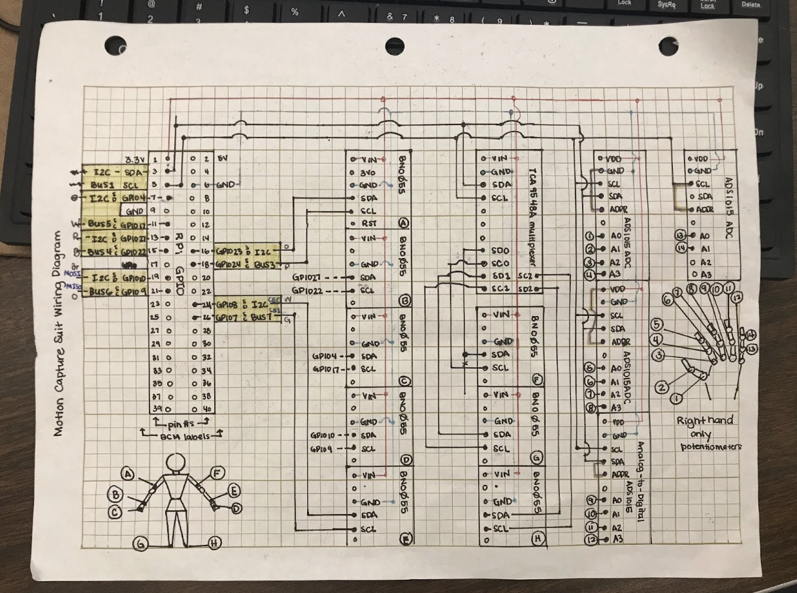

  
  
  

Over the summer of 2021, I was part of a research team at Leeward community college. Our goal was to develop and built a functional full body motion capture suit for use in virtual reality.

## Materials
The materials for our project consist of a mixture of software and hardware:

  - The Power Gloves used Flex Sensors in conjunction with ADS1015 Analog to Digital Converters, which will be referred to as “ADC” from this point on.
  - BNO055 Orientation Sensors, or “Orientation Sensors” for future reference, were used for the Motion Capture Suit
  - We used a Raspberry Pi 4 equipped with Linux Operating System
  - We used Python to program the Raspberry Pi
  - We also used the Unity Engine and Visual Studio (for C# programing)

## Methods
  - The FLEX SENSORS change resistance based upon the amount of bending. We used a voltage divider to determine the resistance and read the voltage with the ADCs
  - The ADCs convert the analog voltage data and converts it into digital data, to be sent to and read by the HOST COMPUTER, in our case, the RASPBERRY PI.
  - The ORIENTATION SENSORS collect yaw, pitch, and roll data from various actuation points, including the head, spine, the arms, and the legs, and also sends that data to the HOST COMPUTER.
  - The RASPBERRY PI is our HOST COMPUTER, which collects all the data from the sensors and sends it to the CLIENT COMPUTER.
  - The CLIENT COMPUTER runs the UNITY ENGINE, which reads and translates all the data being sent from the RASPBERRY PI to animate our Virtual Reality character UNITY-CHAN.

## Results
The project was overall a success. We split the project into two parts the gloves component and the body suit component.
  <h2 class="subheading">Gloves</h2>
    - The flex sensors were glued to each glove finger. Once tested, Raspberry Pi was able to distinguish between 0 45 and 90 degrees for each     finger. We made sure that the bend at each angle didn’t exceed the max amount of voltage (5 volts). We used 3 ADC and voltage dividers to read the sensor. And used the Raspberry Pi to read voltage on a single I2C bus
  <h2 class="subheading">Body Suit</h2>
    - A vest was used with a pocket attached to hold the Raspberry Pi and some of the wiring. This set up allowed for ease of movement while in use.  
    - The raspberry pi collected information from both the gloves and the body suit.
We were able to read all ten of the flex sensors and 12 orientation sensors. We adjusted the raspberry pi to accommodate 6 I2C busses so 2 orientation sensors could be read per bus, so that 
data from all of the sensors can be read by the Raspberry Pi. We then created a socket program to send the data to the client computer, which animates Unity-Chan.
