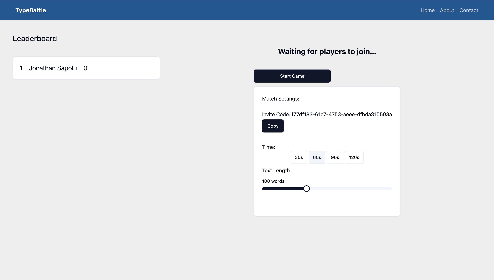

# Project Overview
The goal of this project was to create a real-time multiplayer typing game inspired by TypeRacer. I built Type Battle, a fast-paced typing race experience where users can create private rooms and invite friends using custom codes to compete in real time.

Type Battle uses Next.js and React for the frontend, styled with Tailwind CSS and shadcn/ui to provide a clean and responsive interface. Socket.IO handles the WebSocket communication layer between the client and server, enabling synchronized gameplay with minimal latency.

The game is deployed with the frontend hosted on Vercel and the WebSocket server hosted on Render, ensuring scalability and performance.

## Private Matchmaking

Users can either create a new race room or join an existing one using an invite code. This private match functionality makes it easy to challenge friends and ensures an isolated game session for each group of players.

I focused on smooth user experience, intuitive game flow, and responsiveness across devices. Implementing Socket.IO required managing connection states, race progress, and real-time updates across multiple clients.

## Tech Stack
- Next.js and React for the frontend framework and UI structure
- Tailwind CSS and shadcn/ui for styling and component design
- Socket.IO for WebSocket communication between players
- Render and Vercel for backend and frontend deployment

This project helped solidify my understanding of real-time communication and full-stack deployment while working with modern web technologies.

To try it out, visit the live site: [https://typebattle.vercel.app](https://typebattle.vercel.app)
